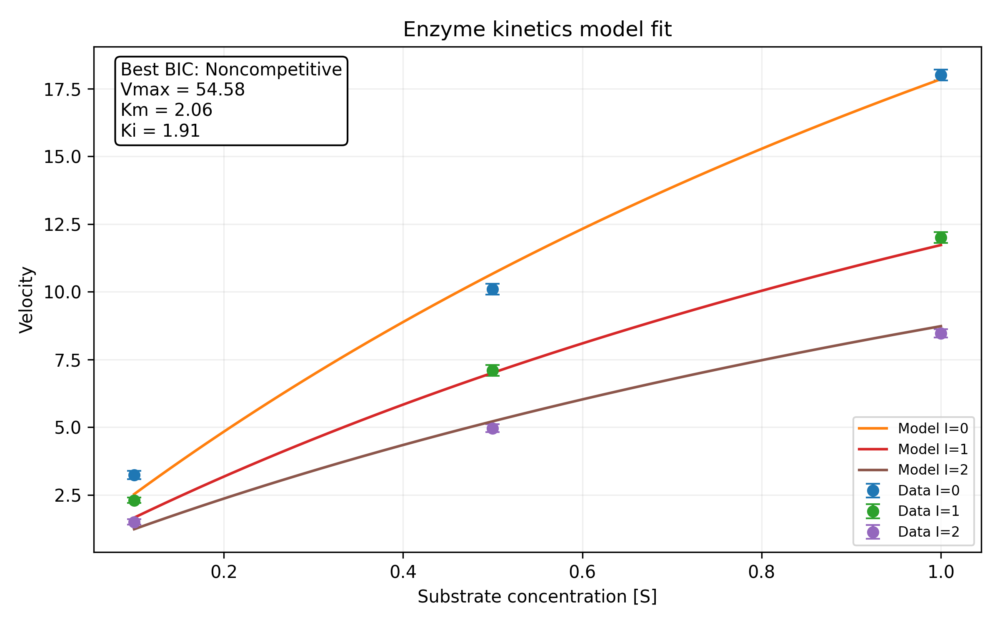
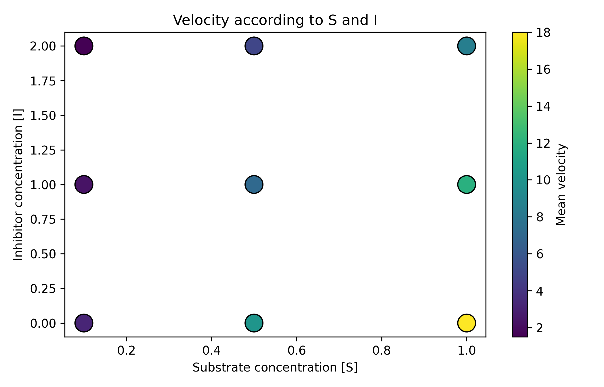
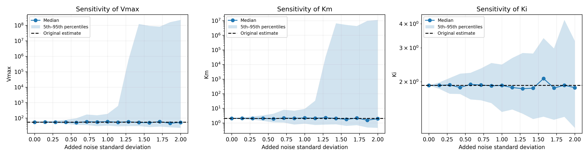
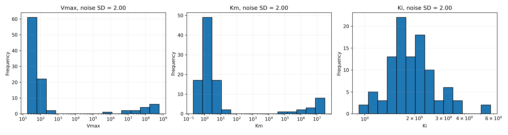

# enzyme-kinetics-model-analyzer
Python tool for fitting enzyme inhibition models, comparing model performance, and evaluating parameter robustness through Monte Carlo simulation.

## Features
- Michaelis-Menten model fitting
- Competitive, noncompetitive and uncompetitive inhibition models
- Model comparison using MSE, AIC and BIC
- Monte Carlo robustness analysis
- Publication-quality visualizations

## Technologies
Python, NumPy, Pandas, SciPy and Matplotlib

## Data
The repository includes a demonstration dataset with substrate
concentrations, inhibitor concentrations and triplicate velocity measurements.

## Running the project
1. Install the required packages:
   pip install -r requirements.txt
2. Open and run `enzyme_kinetics_analysis.ipynb` in Google Colab or Jupyter Notebook.

## Example results

Using the included demonstration dataset, the noncompetitive inhibition
model obtained the lowest BIC among the evaluated models.

| Model | MSE | AIC | BIC |
|---|---:|---:|---:|
| Noncompetitive | 0.1706 | -9.9157 | -9.3240 |
| Competitive | 0.2333 | -7.0991 | -6.5074 |
| Uncompetitive | 0.3477 | -3.5073 | -2.9157 |
| No inhibitor | 6.9225 | 21.4130 | 21.8074 |

Estimated parameters for the selected model:

- Vmax = 54.58
- Km = 2.06
- Ki = 1.91

### Model fit

### Substrate and inhibitor map

### Monte Carlo parameter stability

### Monte Carlo distributions

### Result files

- [Model comparison table](results/model_comparison.csv)
- [Monte Carlo simulation results](results/monte_carlo_results.csv)

## Limitations
Model selection identifies the best-supported model among the candidates
evaluated, but does not independently establish the biological inhibition
mechanism.
